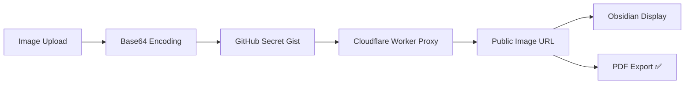

## Pimg - GitHub Gist Image Storage for Obsidian

> **Keep your vault lightweight while storing images securely in the cloud**

A powerful Obsidian plugin that automatically uploads your images to GitHub Gists using base64 encoding, keeping your vault size minimal while ensuring your images are always accessible - even in PDF exports!

### ✨ Features
- 🖼️ **Automatic Image Upload** - Drag & drop or paste images directly into your notes
- 🔒 **Private Storage** - Images stored securely in GitHub Secret Gists  
- 📄 **PDF Export Compatible** - Works perfectly with Obsidian's PDF export feature
- ⚡ **Lightweight Vault** - Only image URLs stored locally, not the actual files
- 🚀 **Fast Loading** - Images served through Cloudflare Workers CDN
- 🔄 **Fallback Support** - Automatically saves locally if upload fails
- ⚙️ **Highly Configurable** - Control paste/drop behavior, progress notifications, and more



### 🛠️ Installation

#### Step 1: Install the Plugin
1. Open Obsidian Settings
2. Go to Community Plugins
3. Search for "Pimg"
4. Click Install and Enable

#### Step 2: Deploy the Cloudflare Worker
1. **Clone the worker repository:**
   ```bash
   git clone https://github.com/MdSadiqMd/Pimg-Obsidian-Worker.git
   cd Pimg-Obsidian-Worker
   ```

2. **Install dependencies:**
   ```bash
   npm install
   ```

3. **Login to Cloudflare:**
   ```bash
   npx wrangler login
   ```

4. **Deploy the worker:**
   ```bash
   npm run deploy
   ```

5. **Note your worker URL** (e.g., `https://pimg.your-subdomain.workers.dev`)

#### Step 3: Create GitHub Personal Access Token
1. Go to [GitHub Settings → Developer Settings → Personal Access Tokens](https://github.com/settings/tokens)
2. Click "Generate new token (classic)"
3. Give it a descriptive name (e.g., "Pimg Obsidian Plugin")
4. Select the **`gist`** scope (Full control of gists)
5. Copy the generated token immediately

#### Step 4: Configure the Plugin
1. Open Obsidian Settings → Community Plugins → Pimg
2. Enter your **GitHub Access Token**
3. Enter your **GitHub Username**
4. Enter your **Cloudflare Worker URL**
5. Configure behavior settings as desired

### 📱 Usage
1. **Paste**: Copy an image and paste it into your note with `Ctrl/Cmd+V`
2. **Drag & Drop**: Drag image files directly into your editor
3. **Automatic**: The plugin handles upload and URL generation automatically

### 📄 License
This project is licensed under the [0BSD License](LICENSE) - see the LICENSE file for details.

### 💖 Support
If you find this plugin helpful, consider supporting its development:

- ⭐ Star this repository
- 🐛 Report bugs and suggest features
- ☕ [Buy me a coffee](https://github.com/sponsors/MdSadiqMd)
- 🔄 Share with other Obsidian users

---

<p align="center">
  <strong>Made with ❤️ by <a href="https://x.com/Md_Sadiq_Md">@MdSadiqMd</a></strong>
</p>

<p align="center">
  <a href="https://obsidian.md">
    
  </a>
</p>
